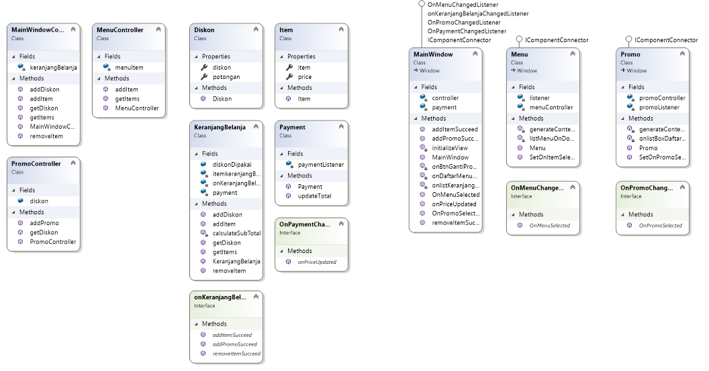

## Onny Vergiean Saputra
## 19.11.2731

# Study Kasus App
Aplikasi sederhana toko sesuai studi kasus yang telah diberikan dosen untuk memenuhi tugas UAS. Aplikasi ini berfungsi untuk simulasi pembelian baik makanan minuman dan dapat mengaplikasikan voucher yang tersedia serta customer dapat melihat menu dan promo yang tersedia

## Scope and Functionalities
- User dapat memasukkan atau menghapus makanan pilihan ke dalam keranjang
- User dapat melihat subtotal makanan yang terdapat pada keranjang
- User dapat melihat daftar voucher yang ditawarkan
- User dapat menggunakan salah satu voucher
- User dapat melihat harga total termasuk potongannya
## How Does it works?
1. Apa Teknik/Konsep yang digunakan dalam Program ini?
 
   Disini saya menggunakan teknik MVC, yang membagi tiap bagian menjadi tugas tugas sendiri setiap bagian tersebut adalah Model View dan Controller

2. Apa Saja Model yang terdapat dalam Program ini?

   Model yang terdapat didalam program ini ada 4 yaitu `Diskon.cs` `Item.cs` `Payment.cs` dan `KeranjangBelanja.cs`. Untuk Model Diskon bertugas untuk mengurusi diskon, Model Item bertugas untuk menampung item, Model Payment digunakan untuk mengurus pembayaran dan logic dari diskon yang dipakai, Model KeranjangBelanja bertugas untuk mengatur setiap item diskon dan pembayaran yang telah dipilih ke KeranjangBelanja

3. Apa Saja Controller yang terdapat dalam Program ini?
   
   Controller yang terdapat dalam program ini ada 3 yaitu `PromoController.cs` `MenuController.cs` dan `MainWindowController.cs`. Untuk Fungsi dari `PromoController.cs` yaitu untuk membuat list diskon, menambahkan diskon dari view dan mendapatkan diskon yang tersedia apa saja dari view , Untuk Controller Menu berfungsi untuk membuat list untuk item menambahkan item dari view dan mendapatkan item yang telah ditambahkan dari Menu View dan untuk MainWindowController berfungsi untuk menambahkan item dan diskon ke view, menghapus item dari view dan mendapatkan data list dari item dan diskon/promo yang digunakan

4. Untuk Alur Programnya dalam program ini bagaimana?

   Dimulai dari `Menu.xaml.cs` disini membuat object item dan akan ditambahkan pada list yang terdapat pada `MenuController.cs`
```csharp
 private void generateContentMenu()
        {
            Item Menu1 = new Item("Coffe Late", 30000);
            Item Menu2 = new Item("Black Tea", 20000);
            Item Menu3 = new Item("Pizza", 75000);
            Item Menu4 = new Item("Milk Shake", 15000);
            Item Menu5 = new Item("Fried Frice Special", 45000);
            Item Menu6 = new Item("Watermelon Juice", 25000);
            Item Menu7 = new Item("Lemon Squash", 30000);

            menuController.addItem(Menu1);
            menuController.addItem(Menu2);
            menuController.addItem(Menu3);
            menuController.addItem(Menu4);
            menuController.addItem(Menu5);
            menuController.addItem(Menu6);
            menuController.addItem(Menu7);

            listMenu.Items.Refresh();
        }
```
   lalu pada `Promo.xaml.cs` juga membuat object Diskon yang akan ditambahkan pada list yang terdapat pada `PromoController.cs`
```csharp
 private void generateContentPromo()
        {
            Diskon diskon1 = new Diskon("Promo Awal tahun Diskon 25 % ", 25000);
            Diskon diskon2 = new Diskon("Promo Tebus Murah Diskon 30 % atau maksimal 30.000", 30000);
            Diskon diskon3 = new Diskon("Promo Natal Potongan 10000", 10000);

            promoController.addPromo(diskon1);
            promoController.addPromo(diskon2);
            promoController.addPromo(diskon3);

            listBoxDaftarPromo.Items.Refresh();
        }
```
   Kemudian pada `Mainindow.xaml.cs` terdapat inisialisasi dan instance dari class lainnya yaitu payment, KeranjangBelanja dan MainWindowController dan terdapat juga Itemsource dari item dan diskon yang akan ditampilkan pada listbox item dan diskon yang dipakai
 ```csharp
  public MainWindow()
        {
            InitializeComponent();
            payment = new Payment(this);
            KeranjangBelanja keranjangBelanja = new KeranjangBelanja(payment, this);
            controller = new MainWindowController(keranjangBelanja, payment);

            listKeranjangBelanja.ItemsSource = controller.getItems();
            listPromo.ItemsSource = controller.getDiskon();

            initializeView();

        }
```

## ClassDiagram



